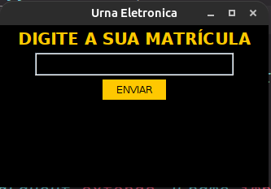
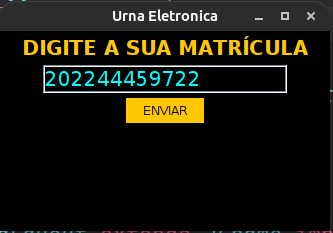
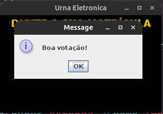
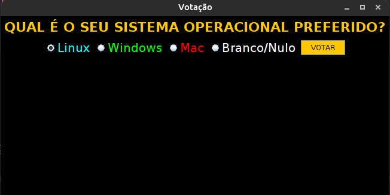
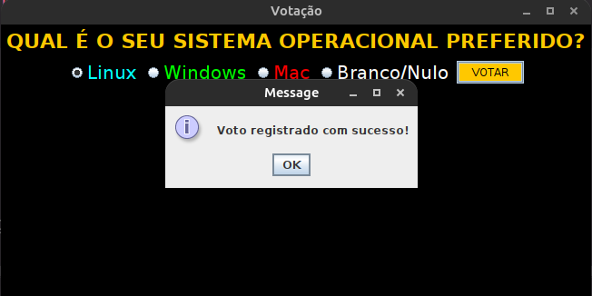
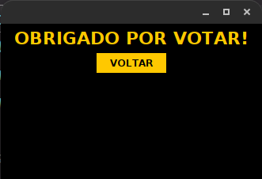

# Urna Eletronica - Projeto POO

O projeto se trata de um sistema de votos onde um usuário irá entrar com a sua matrícula de uma universidade y e 
caso essa matrícula exista no sistema, ele poderá depositar o seu voto. Para isso foi adotado o seguinte tipo de 
votação:
1. O usuário poderá votar quantas vezes quiser, desde que esteja devidamente cadastrado no sistema.
2. Os votos são armazenados no arquivo votos.txt, cada voto é acompanhado de uma hash que é a matrícula do usuário. 
   Dessa forma garantimos a autencidade do voto.
3. O extrato de votação se encontra no arquivo votos.txt
4. Não há uma tela de exibição de ganhador, foi adotado a ideia de que o extrato seria lido por agentes externos e 
   os votos seriam computados em um sistema externo, exibindo assim o vencedor.
5. Para entrar no sistema foi disponibilizado 5 matrículas, sendo elas:
```txt
202244459722
202233359722
202222259722
202211159722
202200059722
```

## Para utilizar o sistema é necessário ter a JDK 8 instalada em sua máquina.

## Algumas imagens da interface gráfica de votação:







